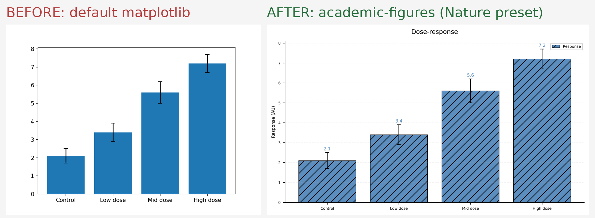
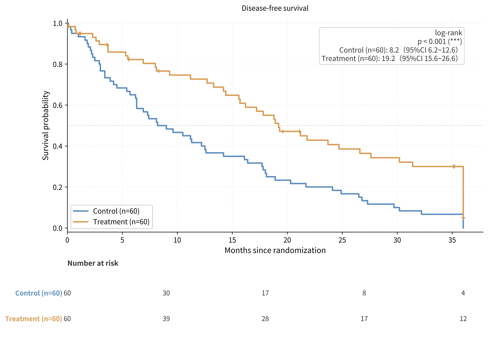

# academic-figures

**Publication-ready research figures from a single command.**

Stop losing hours to matplotlib tweaking. `academic-figures` turns CSV/JSON/Excel data into
journal-ready figures — forest plots, Kaplan-Meier curves with risk tables, ROC with DeLong
comparison, PRISMA 2020 flow diagrams, and 17 more chart types — with journal presets
(Nature, Lancet, Science, Cell, NEJM, JAMA, IEEE, CMA, CN-core), built-in quality gates,
and first-class Chinese support.



> | | |
> |---|---|
> | **License** | MIT-0 (no attribution required) |
> | **Status** | v2.4.0 · 153 tests passing |
> | **Data privacy** | 100% local. Your data never leaves the machine. |

---

## Quick start

```bash
pip install matplotlib numpy scipy openpyxl     # or: python3 scripts/setup_env.py
python3 scripts/gen_figure.py -t bar -d data.csv -o figure.tiff --journal nature
```

That's it. One command, a print-ready figure.

**Excel directly** — `--data data.xlsx --sheet Sheet1`
**Vector output** — PDF / SVG / EPS for submission
**Batch mode** — `--batch figures.json` renders a whole figure set and writes a report

## 21 chart types

| Statistics | Clinical / Research | Review & Reporting |
|---|---|---|
| bar · grouped bar · stacked · hbar | **Kaplan-Meier** (auto risk table + log-rank + median survival CI) | **PRISMA 2020** flow (arithmetic auto-validated) |
| line · dual-axis · scatter | **ROC** (AUC + paired DeLong comparison) | **forest** (meta-analysis + leave-one-out sensitivity) |
| box · violin (**auto significance**: Welch / Mann-Whitney / Tukey / Dunn+Hochberg) | **Bland-Altman** agreement | **diagram** (CONSORT-style flowboxes) |
| heatmap · **clustered heatmap** (Ward) | **paired before-after** | composite multi-panel |
| **PCA** score plot | **funnel** (meta, +Egger test) | **Venn** (2–3 sets, exact counts) |



## Built-in quality gates

Things that get papers bounced back, caught before you export:

- **PRISMA arithmetic validation** — the flow diagram refuses to render if your counts don't add up
- **PDF text-overlap verification** (`--verify`) — pixel-level collision detection, exit code 2 on overlap
- **Minimum font-size audit** — journal presets warn when text drops below e.g. Nature's limits
- **Pre-payment data validation** — bad input produces a clear error + fix suggestion, never a half-finished figure

## Statistics you don't have to hand-roll

- KM: auto risk table, Mantel-Haenszel log-rank, median survival with 95% CI
  (verified identical to R `survival`/lifelines on randomized datasets)
- `--stats auto`: each group vs. first (Shapiro → Welch t / Mann-Whitney U), brackets drawn
- `--stats multi`: all-pairs (ANOVA + Tukey HSD / Kruskal-Wallis + Dunn, Hochberg-adjusted)
- ROC `--compare`: paired DeLong test between models
- Meta `--sensitivity`: leave-one-out re-pooling (DerSimonian-Laird) rendered under the forest plot
- Funnel `--egger`: publication-bias regression line

## Journal presets (9)

`nature` · `lancet` · `science` · `cell` · `nejm` · `jama` · `ieee` · `cma` (Chinese Medical
Association) · `cn-core` (Chinese core journals) — column widths, font sizes, minimum text
size, and font family handled for you. The Chinese presets auto-enable CJK fonts.

## Works with AI agents too

`academic-figures` ships as an [AI-agent skill](SKILL.md): point Claude Code (or any agent
framework that reads SKILL.md) at your data and say *"make a forest plot"* — the agent
cleans your data, validates it, and renders the figure.

Available on skill registries:
[ClawHub](https://clawhub.ai) · SkillHub (`academic-figures`, 论文配图一键生成)

## Honest limitations

- Needs Python 3.9+ locally (matplotlib/numpy/scipy)
- No 3D plots, no interactive figures — this is for print/submission
- Composite panels can't nest composites
- Clustered heatmap caps at 3,000 rows (hierarchical clustering memory)
- Full list: [references/limits.md](references/limits.md)

## Documentation

| Doc | Contents |
|---|---|
| [SKILL.md](SKILL.md) | full capability reference (agent-facing) |
| [references/data-formats.md](references/data-formats.md) | exact input schema per chart type |
| [references/limits.md](references/limits.md) | data volume limits + parameter compatibility matrix |
| [references/faq.md](references/faq.md) | common questions, fast answers |
| [references/pitfalls.md](references/pitfalls.md) | deep pitfalls and how they were fixed |
| [templates/](templates/) | 16 runnable scenario templates (copy a JSON, swap your numbers) |

## Tests

```bash
python3 tests/run_tests.py    # 153 regression tests, stdlib unittest only
```

Statistics implementations are cross-validated against reference libraries
(lifelines, scikit-posthocs) and published textbook datasets.

## License

[MIT-0](LICENSE) — use it, fork it, no attribution required.
